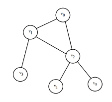
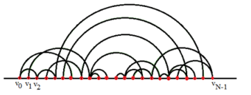

# Graph_Visualisation_Builder

A tool for creating arc diagrams from graphs with N nodes. It takes node relationships as input and generates a comprehensive arc diagram, visually mapping the interconnections between nodes.
 
## The goal of this algorithm is to build an arc diagram from a graph G with N nodes. 

The input of the algorithm is N nodes with all the relationships between the nodes represent an arc

The output is an arc diagram showing the relationships between the nodes

The goal is to bring each node closer to its neighbors, which is equivalent to minimizing the distance of each node from the barycenter of its neighbors.
